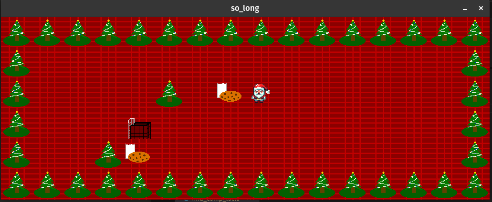
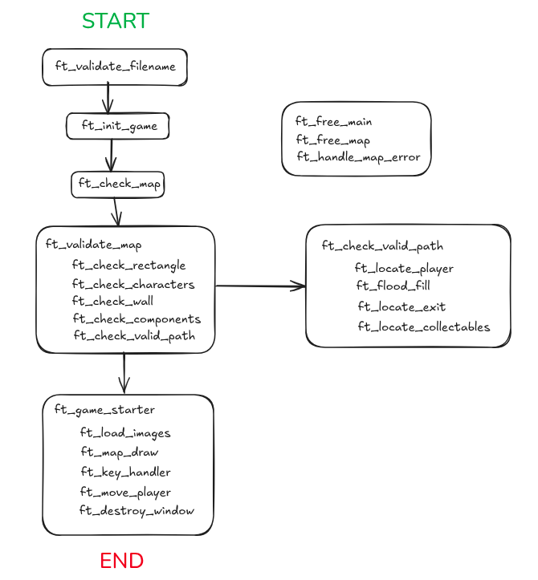

# 🎄 so_long — 2D Mini Game with MiniLibX

_A simple christmas-themed 2D game built using C and the MiniLibX graphics library._

---

## 🕹️ About the Project

**so_long** is a project developed as part of the 42 curriculum. The goal is to build a small 2D game using the **MiniLibX** graphics library, managing window rendering, keyboard input, and path validation from a map file.

In this implementation, the player takes the role of **Santa Claus** who must collect **cookies** and exit the map by navigating through a forest of **Christmas trees**.

> The player can move using `W`, `A`, `S`, `D` keys. Movement count is displayed in the terminal.

---

## 📷 Preview



---

## The Rules

- The game starts by checking the `.ber` map file for format and validity.
- The map must include:
  - Exactly 1 Player (`P`)
  - At least 1 Collectible (`C`)
  - Exactly 1 Exit (`E`)
  - Only allowed characters: `0`, `1`, `P`, `E`, `C`
- Map must be rectangular and enclosed by walls.
- A valid path from the player to all collectibles and the exit is required.

---

## 📊 Flow Diagram




---

## File Structure

| File                  | Description                                        |
|-----------------------|----------------------------------------------------|
| `main.c`              | Entry point, game setup and cleanup                |
| `check_map.c`         | Loads and validates map from `.ber` file           |
| `check_map_helper.c`  | Checks map shape, components, and wall structure   |
| `map_path_check.c`    | Uses flood fill algorithm to validate path         |
| `game_starter.c`      | Initializes MLX, loads images, and starts game     |
| `mlx_operations.c`    | Handles drawing, window destruction                |
| `movement.c`          | Updates player position and checks win condition   |
| `free.c`              | Memory management and error handling               |

---

## Running the Game

### Requirements
- Linux
- `MiniLibX` graphics library

### Compile the Game

```bash
make
```

### Run with a Map

```bash
`./so_long maps/holiday.ber`
```

## Example Map Format

```
1111111
1P0C0E1
1000001
1111111
```

Characters:

- `1`: Wall
    
- `0`: Empty space
    
- `P`: Player
    
- `C`: Collectible
    
- `E`: Exit

## License

This project is for academic and personal purposes.
